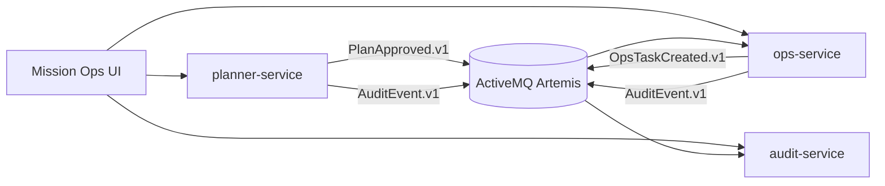

# GroundOps GPL Showcase

GroundOps is a compact, high-signal “Ground Product Line–style” mission-ops pipeline: mission planning → approval → event-driven tasking → audit trail → executive summary. It’s intentionally small (3 services + broker + UI) but demonstrates real boundaries, traceability, and UX polish.

## Architecture (at a glance)


## Screenshots


## Quickstart
Prereqs: Docker Desktop, JDK 21 (only needed for local builds/tests).

```bash
./scripts/run-local.sh
```

Open:
- UI: [http://localhost:5173](http://localhost:5173)
- planner-service: [http://localhost:8080](http://localhost:8080)
- ops-service: [http://localhost:8081](http://localhost:8081)
- audit-service: [http://localhost:8082](http://localhost:8082)
- Artemis console: [http://localhost:8161](http://localhost:8161) (user/pass: `admin`/`admin`)

Generate a local dev token for a role (optional, UI also mints tokens in-browser):
```bash
./scripts/generate-token.sh PLANNER
```

Seed demo data (optional):
```bash
./scripts/seed-demo.sh
```

> Note: JWTs use an HS256 secret (32+ bytes). The default is set in `scripts/run-local.sh` and docker compose.

## Demo Scenario
1. In Mission Planner, create a plan (asset, start/end time, priority).
2. Approve the plan to publish `PlanApproved.v1`.
3. Ops Tasking shows the derived task (polling updates).
4. Audit Trail records all actions with correlation IDs.
5. Executive Summary reflects readiness and recent changes.

## What This Demonstrates
- Microservices with clear service boundaries
- REST + async messaging (JMS/Artemis)
- Role-based access control with local JWTs
- End-to-end correlation IDs (HTTP → events → logs)
- Containerized local dev via docker compose
- Testcontainers integration test
- Polished mission-ops UI

## Docs
- Architecture: docs/architecture.md
- Threat Model: docs/threat-model.md
- Demo Walkthrough: docs/demo-walkthrough.md
- ADRs: docs/adr/
- Contracts: contracts/ (OpenAPI + event schemas)

## Design Notes (Intentional Tradeoffs)
- **Minimal persistence:** In-memory stores keep the footprint tiny and fast.
- **Local auth only:** JWTs are dev-mode; no external IdP needed.
- **Focused scope:** Demonstrates traceability over full RBAC or multi-tenant complexity.
- **JMS over streaming:** Clear event boundaries, not maximum throughput.

## Repo Layout
```
README.md
contracts/
  events/
  openapi/
docs/
  adr/
  architecture.md
  demo-walkthrough.md
  threat-model.md
  screenshots/
infra/
  docker-compose.yml
scripts/
  run-local.sh
  generate-token.sh
  seed-demo.sh
  capture-screenshots.sh
services/
  planner-service/
  ops-service/
  audit-service/
web/
```

## Running Tests
```bash
mvn -q -DskipTests=false test
```

> Note: Requires Maven 3.9+ locally. Tests use Testcontainers for Artemis.

## Capture Screenshots
```bash
./scripts/capture-screenshots.sh
```

---
If you want a guided walkthrough, start with docs/demo-walkthrough.md.
