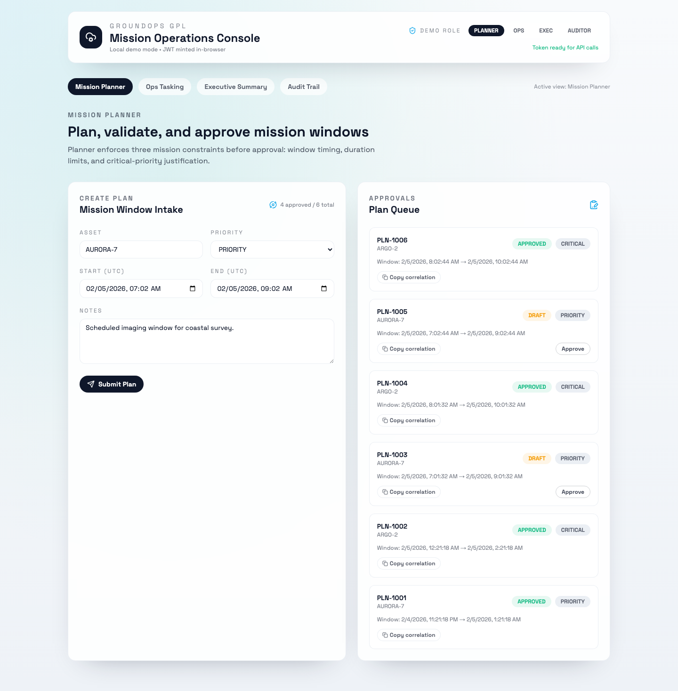
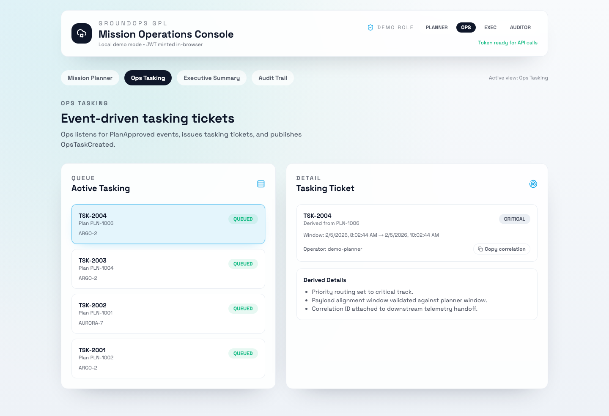
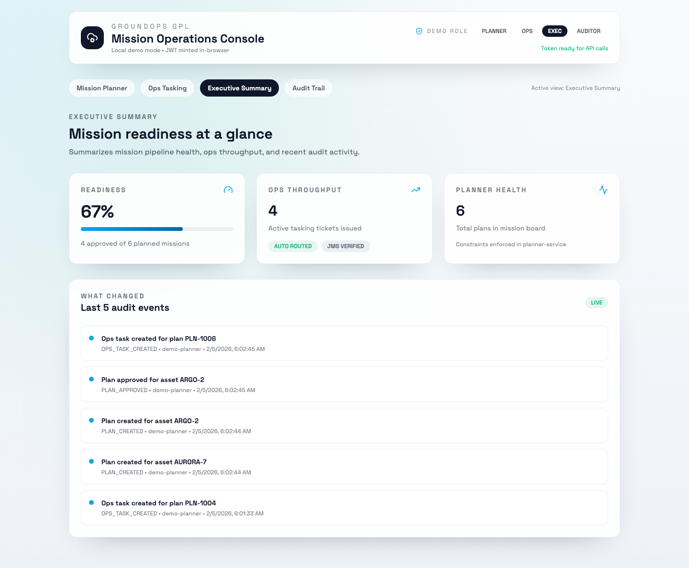
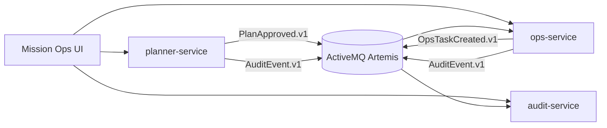

# GroundOps GPL Showcase


GroundOps is a compact mission-ops pipeline: plan a mission window, approve it, generate ops tasking via events, record an audit trail, and surface an executive summary. It’s intentionally small (3 services + broker + UI) but built to feel like real ground/mission operations software.

## At a glance
- **What it is:** Mission planning → approval → event-driven tasking → audit trail → executive summary.
- **Why it matters:** Mirrors ground/mission-ops patterns: integration across services, traceability, and clear security boundaries.
- **How to run:** One command, local-only, free (Docker Compose).

**Proof of traceability:** Every user action and message is tagged with a correlation ID visible in the UI and logs.

## Tech Stack (in one glance)
- **Backend:** Java 21 + Spring Boot 3.x
- **Messaging:** ActiveMQ Artemis (JMS)
- **Auth:** Local JWT roles (PLANNER, OPS, AUDITOR, EXEC)
- **Infra:** Docker Compose
- **Testing:** Testcontainers integration test
- **UI:** React + Vite + TypeScript + Tailwind

## Where to start
- Demo story: docs/demo-walkthrough.md
- Architecture: docs/architecture.md
- Proof (tests): tests/integration-tests/ + `./mvnw test`

## Happy path demo


## Screenshots





## Architecture (at a glance)


## Quickstart
Prereqs: Docker Desktop, JDK 21 (only needed for local builds/tests).

```bash
./scripts/run-local.sh
```

Open:
- UI: [http://localhost:5173](http://localhost:5173)
- planner-service: [http://localhost:8080](http://localhost:8080)
- ops-service: [http://localhost:8081](http://localhost:8081)
- audit-service: [http://localhost:8082](http://localhost:8082)
- Artemis console: [http://localhost:8161](http://localhost:8161) (user/pass: `admin`/`admin`)

Generate a local dev token for a role (optional, UI also mints tokens in-browser):
```bash
./scripts/generate-token.sh PLANNER
```

Seed demo data (optional):
```bash
./scripts/seed-demo.sh
```

> Note: JWTs use an HS256 secret (32+ bytes). The default is set in `scripts/run-local.sh` and docker compose.

## Demo Scenario
1. In Mission Planner, create a plan (asset, start/end time, priority).
2. Approve the plan to publish `PlanApproved.v1`.
3. Ops Tasking shows the derived task (polling updates).
4. Audit Trail records all actions with correlation IDs.
5. Executive Summary reflects readiness and recent changes.

## Why this maps to Ground Product Line (GPL) work
- **Mission flow realism:** Planning → approval → tasking mirrors real ops pipelines.
- **Integration across boundaries:** REST for user actions, JMS events for system-to-system handoffs.
- **Traceability built-in:** Correlation IDs propagate from HTTP → messaging → logs and UI.
- **Security boundaries are explicit:** Roles are enforced per service (planner/ops/audit/exec).
- **Operational credibility:** Containerized local stack and an integration test that exercises the broker.
- **UX polish:** A mission-ops dashboard that’s clean, navigable, and grounded in the domain.

## Docs
- Architecture: docs/architecture.md
- Threat Model: docs/threat-model.md
- Demo Walkthrough: docs/demo-walkthrough.md
- ADRs: docs/adr/
- Contracts: contracts/ (OpenAPI + event schemas)

## Design Notes (What I intentionally kept small)
- **No cloud deployment:** Local-only so it runs free and fast.
- **No full identity provider:** JWTs are dev-mode for clarity.
- **Minimal constraints engine:** A few realistic checks rather than a full planner.
- **In-memory stores:** Enough to demonstrate flow without operational overhead.
- **JMS over streaming:** Clear event boundaries rather than scale tuning.

## Running Tests
```bash
./mvnw -q test
```

> Note: Requires Docker for Testcontainers (Artemis).

## Capture Screenshots
```bash
./scripts/capture-screenshots.sh
```

## Capture Demo GIF
```bash
./scripts/capture-demo-gif.sh
```

## Repo metadata (GitHub About)
Suggested description: A compact mission-ops pipeline (planning → approval → tasking → audit → exec view) built with Java, Spring Boot, JMS, and a polished UI.

Suggested topics: java, spring-boot, microservices, jms, activemq, docker-compose, react, vite, tailwind, testcontainers, mission-ops, audit-logging

## Repo Layout
```
README.md
contracts/
  events/
  openapi/
docs/
  adr/
  architecture.md
  demo-walkthrough.md
  threat-model.md
  screenshots/
infra/
  docker-compose.yml
scripts/
  run-local.sh
  generate-token.sh
  seed-demo.sh
  capture-screenshots.sh
  capture-demo-gif.sh
services/
  planner-service/
  ops-service/
  audit-service/
web/
```

---
If you want a guided walkthrough, start with docs/demo-walkthrough.md.
