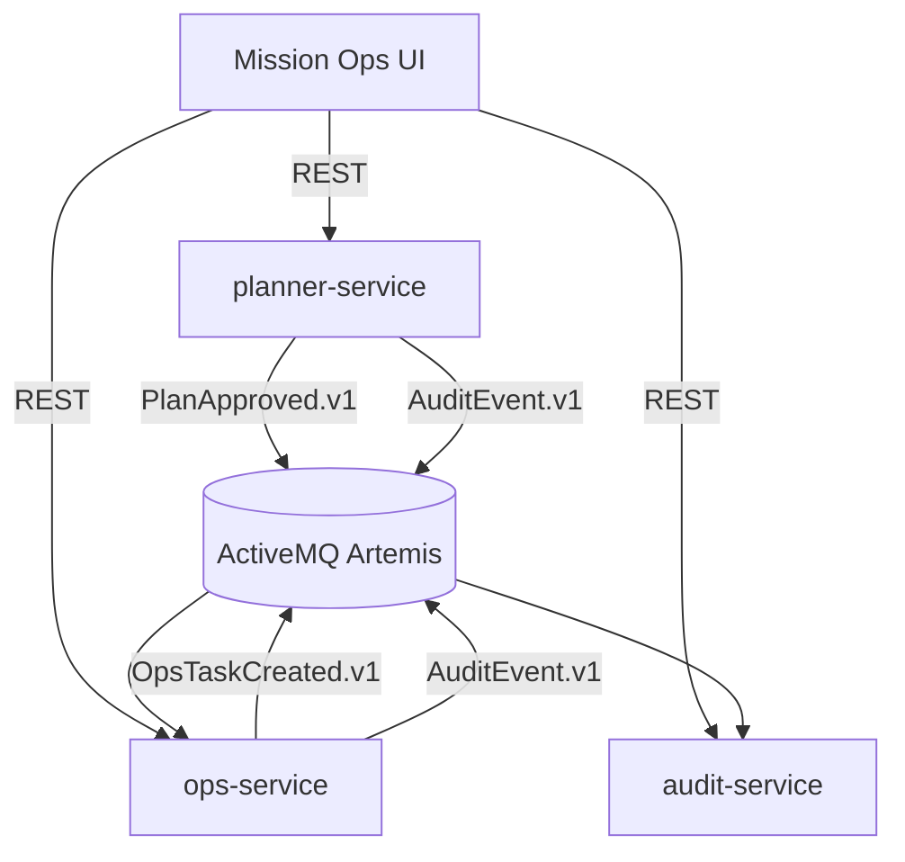

# Architecture

GroundOps GPL Showcase models a compact mission-ops pipeline: mission planning → approval → event-driven tasking → audit trail → executive summary. The focus is on realistic boundaries, observability, and contracts, not scale.

## System Diagram

## Service Responsibilities
- **planner-service**
  - Owns mission plan lifecycle (draft → approved)
  - Enforces planning constraints
  - Publishes `PlanApproved.v1` and `AuditEvent.v1`

- **ops-service**
  - Subscribes to `PlanApproved.v1`
  - Creates tasking tickets
  - Publishes `OpsTaskCreated.v1` and `AuditEvent.v1`

- **audit-service**
  - Subscribes to `AuditEvent.v1`
  - Stores append-only audit records
  - Provides filterable audit queries

## Cross-Cutting Concerns
- **Correlation IDs**: `X-Correlation-Id` is generated per request, propagated to events, and logged via MDC.
- **Security**: Local JWT roles gate access (`PLANNER`, `OPS`, `AUDITOR`, `EXEC`).
- **Observability**: Structured JSON logs and Actuator health/info endpoints.
- **Contracts**: OpenAPI specs in `contracts/openapi`, event schemas in `contracts/events`.

## Data Storage
In-memory stores keep the demo lightweight and fast. The design is intentionally structured to be swappable for a persistent store if required.
